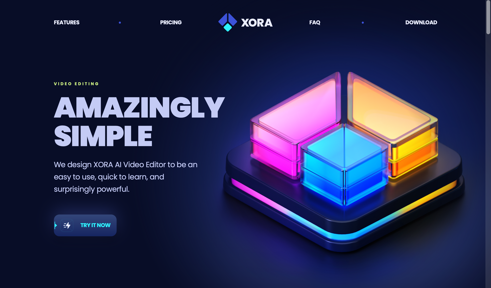
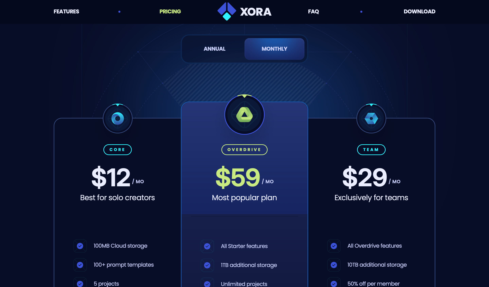

# Xora Landing Page

This is a visually stunning frontend of a SaaS app landing page that is developed using React.js and Tailwind CSS.

## Table of contents

- [Overview](#overview)
  - [Screenshots](#screenshots)
  - [Links](#links)
- [My process](#my-process)
  - [Built with](#built-with)
- [Author](#author)
- [Acknowledgements](#acknowledgements)

## Overview

### Screenshots

Viewport

Pricing

### Links

The live site URL - [Xora Landing Page](https://saas-xora-page.netlify.app/)

## My Process

### Built with

- React.js
- Custom CSS classes/utilities using Tailwind CSS
- Semantic HTML5 markup
- Mobile-first workflow (responsive for all screen sizes)
- React dependencies like clsx, react-collapse, countup, etc
- Assets from JSMastery

## Author

- Frontend Mentor - [@Gokul221](https://www.frontendmentor.io/profile/Gokul221)
- LinkedIn - [Gokul Bhoi](https://www.linkedin.com/in/gokul-bhoi-3b8b39188)

## Acknowledgements

Thanks to Adrian from JSMastery for this project guidance.

